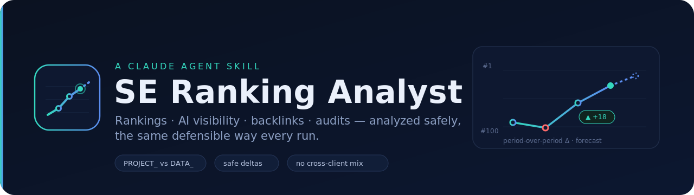

<p align="center">
  
</p>

<p align="center">
  <em>Turn raw SE Ranking data into a defensible SEO analysis — the same way every run.</em>
</p>

<p align="center">
  
  
  
</p>

---

# SE Ranking Analyst — a Claude Agent Skill

A Claude [Agent Skill](https://support.claude.com/en/articles/12512180-use-skills-in-claude) that turns raw [SE Ranking](https://seranking.com) data into a defensible SEO analysis. It gives Claude a settled workflow — which tool to call, how to compute change over time, and how to shape the report — so every run is fast, consistent, and safe instead of improvised from scratch.

Works with the SE Ranking **MCP connector** (recommended) or the SE Ranking **API** in a pipeline.

> Not an official SE Ranking or Anthropic product. It runs on **your** SE Ranking account and consumes **your** API credits / tokens.

---

## What this skill is

Out of the box, Claude *can* call SE Ranking's tools — but it has to figure out, every single time, which of the dozens of available tools fits the question, how to line up comparable dates, and how to turn a pile of numbers into a report. That improvisation is slow and easy to get wrong.

This skill encodes that knowledge once. When a task touches SE Ranking data, Claude loads the skill and follows a fixed, reviewed procedure: identify the project, pull the right metrics for two comparable periods, compute the change safely, and write the report in a consistent shape. It is **instructions only** — no executable code, no stored credentials.

## What it's for

The skill solves three recurring problems with SEO data work in an AI assistant:

1. **Right tool, first time.** SE Ranking splits its tools into two families — `PROJECT_*` (your own tracked projects, by `site_id`) and `DATA_*` (research on any domain, which spends data-API credits). Choosing the wrong family is the most common and most wasteful mistake. The skill settles the choice up front.
2. **Trustworthy numbers.** It enforces hard rules against the classic automated-reporting failure mode, where a credit-saving shortcut quietly backfills one client's report with another brand's or another period's data and reports it as normal. One project per report, missing data stays missing, nothing is silently reused.
3. **A consistent, defensible deliverable.** Every report comes out in the same shape, ending with an auditable "Data notes" section that records exactly what was compared and where data was absent.

## Functions

- **Project & date resolution** — finds the correct tracked project and picks comparison dates that actually exist (real check dates, not interpolated ones).
- **Rankings analysis** — position history, week-over-week deltas, threshold-based "what moved" filtering, competitor SERP comparison.
- **AI / LLM search-visibility analysis** — brand share-of-mentions across ChatGPT, Perplexity and other engines; prompts gained or lost; multi-brand leaderboards.
- **Backlink analysis** — net referring-domain change, new vs lost links over a period, profile summaries, authority and anchor breakdowns.
- **Site audits** — new critical issues vs the previous crawl, resolved issues, pages affected by a specific issue.
- **Keyword & competitor research** — bulk keyword metrics, related/long-tail/question expansion, competing-domain discovery, keyword-overlap comparison.
- **Safe delta engine** — per-metric current-minus-baseline change, direction stated in words, no cross-client contamination, gaps reported as "no data".
- **Report generator** — a fixed structure (TL;DR → rankings → AI visibility → backlinks → audit → recommended actions → data notes), tunable thresholds, optional house style.

## Who it's for, and the tasks it handles

**SEO & digital-marketing agencies** managing many client sites
- Produce a weekly or monthly client report comparing this period to a baseline, with a TL;DR and prioritised actions.
- Run each client as an isolated pass so no client's data ever leaks into another's report.
- Draft the client-facing email or summary for human approval before anything is sent.

**In-house SEO / content teams** tracking a single domain
- "What moved this week?" across our tracked keywords, filtered to changes that actually matter (±3 positions or crossing the top-10 / top-3 boundary).
- Pull position history for a campaign and quantify week-over-week movement.
- Surface new critical audit issues since the last crawl and confirm which were resolved.

**AI-visibility / GEO / AEO specialists** monitoring brands in LLM answers
- Track a brand's share-of-mentions across ChatGPT/Perplexity over a period.
- Identify the prompts where a brand newly appeared or dropped out of AI answers.
- Compare several brands or domains on an AI-visibility leaderboard.

**SEO automation & RevOps builders** wiring SE Ranking into n8n / API / MCP pipelines
- Use Claude as the safe analysis layer on top of scheduled SE Ranking pulls.
- Apply the same safe-delta rules (no backfill, no cross-client substitution) inside an automated flow.
- Keep a human approval gate before client delivery rather than fully auto-sending.

**SEO consultants & analysts** doing on-demand research
- Summarise any domain's backlink profile and flag losses from high-authority domains.
- Discover a domain's organic competitors and compare keyword overlap.
- Pull bulk keyword metrics and expansion (related, long-tail, question keywords) for a content plan.

### Example prompts

- "Build this week's SE Ranking report for example.com vs last week."
- "What moved in our AI visibility for [brand] this month — which prompts gained or lost mentions?"
- "Compare our tracked keywords against competitor X in the top 10."
- "Net referring-domain change for example.com over the last 30 days; flag anything lost from a high-authority domain."

You don't have to name the skill — Claude triggers it from the task itself. Its first step is always to confirm the exact project/domain back to you, because a wrong `site_id` is the most expensive error and the cheapest to catch early.

## Prerequisites

1. A Claude plan with **Skills** support and **Code execution & file creation** enabled (Settings → Capabilities).
2. The **SE Ranking MCP connector** connected in Claude — or SE Ranking **API** access if you drive it from a pipeline.

## Install (Claude.ai / Claude app)

1. Download `se-ranking-analyst.skill` from [Releases](../../releases).
2. In Claude, open **Customize → Skills**.
3. Click **+** / **Upload skill** and select the file.
4. Toggle the skill **on**.

For **Claude Code**, place the skill folder at `.claude/skills/se-ranking-analyst/`. For the **Skills API**, upload the same package (it has no dependencies to pre-install).

## Repo structure

```
se-ranking-analyst/
├── SKILL.md              # the skill: workflow, safe-delta rules, report format
└── references/
    └── endpoints.md      # tool map by category (rankings, AI, backlinks, SERP, audit, …)
```

## Customising it

- **Thresholds / report shape:** edit `SKILL.md` (Step 4 and Step 5).
- **House style:** add your agency's report template under Step 5.
- **New categories or tools:** extend `references/endpoints.md`.

## Build the `.skill` from source

A `.skill` file is a ZIP whose root is the skill folder:

```bash
zip -r se-ranking-analyst.skill se-ranking-analyst -x "*/__pycache__/*" "*.DS_Store"
```

## Privacy & safety

No `site_id`s, API keys, or client names are baked in — the skill is instructions only and runs on each user's own projects. It explicitly forbids merging data across clients and forbids substituting missing data, which is the main way automated reports leak one client's numbers into another's.

## License

Add a license of your choice (MIT is a common default for shareable skills).
